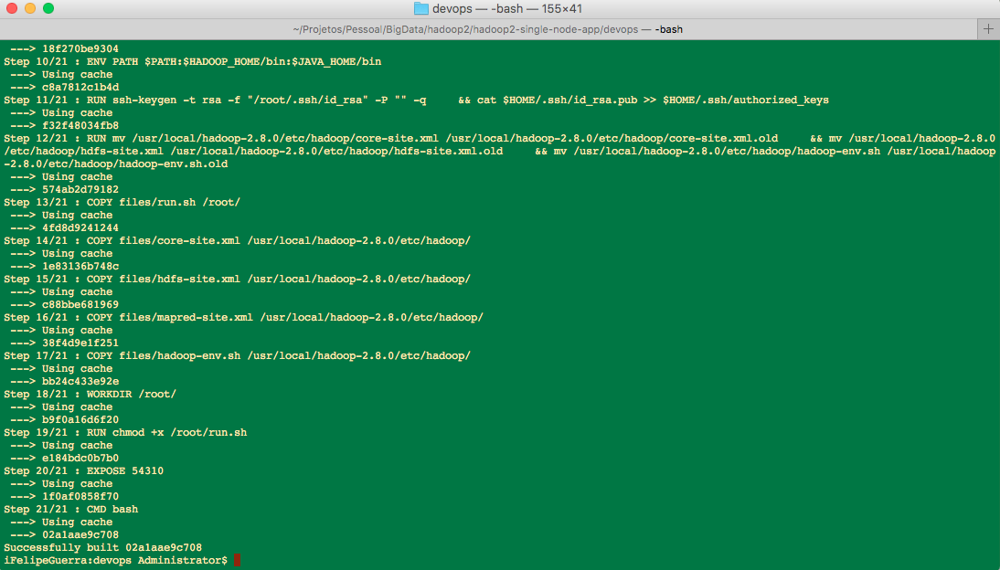
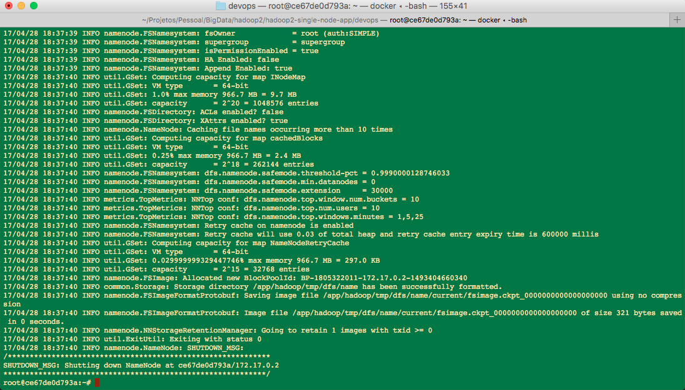
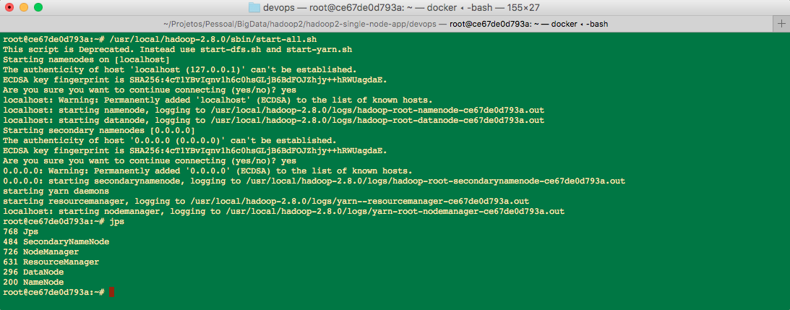

# Big Data for Newbies?

## O que é Big Data?
***”Desde os primórdios da civilização até 2003, a humanidade gerou 5 exabytes de dados. Agora vamos produzir 5 exabytes a cada 2 dias... E o ritmo está aumentando.”***

**Eric Schimidt**
CEO Google 2001-2011


Grandes volumes de dados, há alguma controvérsia sobre a quantidade - se maior que 5Tb - a serem processados de uma vez.
Com o advento de grandes data sets gerados na rede mundial de computadores, em meados de 2003, o Google criou um novo paradigma de processamento de dados massivo utilizando *clusters* de máquinas consideradas commodity, o que permitiria grande escalabilidade horizontal, sem a necessidade de investimento em *hardware* proprietário de supercomputadores.

## O Apache Hadoop
Com a necessidade de processamento intensivo de grandes *data sets*, o Google criou o Hadoop. O Hadoop utiliza o paradigma *MapReduce programming model*, que possibilita o processamento em paralelo desses grandes *data sets*. O core do Hadoop é constituído do HDFS e o MapReduce. O processamento é feito levando o código empacotado para os nodes do cluster, tirando vantagem de onde os dados estão localizados.

O framework do Hadoop core é constituído por:
* Hadoop Common
* Hadoop Distributed File System (HDFS)
* Hadoop YARN
* Hadoop MapReduce

O termo Hadoop é normalmente utilizado para descrever o ecossistema de módulos e submódulos que podem ser adicionados ao *core*:  **Apache Pig, Apache Hive, Apache HBase, Apache Phoenix, Apache Spark, Apache ZooKeeper, Cloudera Impala, Apache Flume, Apache Sqoop, Apache Oozie, e Apache Storm**.

O *framework* do Hadoop é escrito, quase na totalidade, em Java, com algumas exceções em C.

## Hadoop Distributed File System
O HDFS tem muitas similaridades com um *file system* comum, entretanto, as diferenças são significativas: o HDFS é altamente tolerante a falhas, permite um *throughput* muito alto, o que torna-o uma ótima escolha para aplicações com grandes *data sets*.

Premissas e objetivos a serem observados:

* Falhas de Hardware - falhas de *hardware* são a regra e não a exceção;
* Streaming Data Access - o HDFS é projetado para acesso *batch* dos dados, a ênfase é atingir um *throughput* muito alto ao invés de baixa latência;
* Grandes Data Sets - aplicações rodando no HDFS tem grandes *data sets*, um arquivo típico é medido em Gb ou Tb;
* Modelo de Coesão Simples - o HDFS necessita do modelo *write-once-read-many* para acesso dos arquivos;
* “Moving Computation is Cheaper than Moving Data” - o processamento requisitado por uma aplicação é muito mais eficiente quando realizado onde os dados estão armazenados, isso é especialmente verdadeiro quando os *data sets* são enormes;
* Portabilidade - há uma série de tipos de *hardware* e plataformas de *software*, o HDFS é projetado para ser portável e instalado nesses diferentes tipos.

O HDFS possui arquitetura do tipo master/slave:


Essa arquitetura distribuída, permite confiabilidade e resiliência dos arquivos que são armazenados, através do mecanismo de replicação dos *data sets*. O HDFS armazena cada arquivo como uma sequência de blocos. Tanto o mecanismo de replicação, como o tamanho de bloco são configuráveis.

## Hadoop MapReduce
O MapReduce é o *framework* do Hadoop para processar grandes *data sets*, paralelamente, em grandes *clusters* (que podem chegar a milhares de máquinas) de maneira confiável e tolerante a falhas. Normalmente, o processamento de um *job* MapReduce divide um *data set* em múltiplas partes que são os *inputs* para a tarefa de ***map***, executados paralelamente. *Inputs* e *outputs*, são gravados em disco para que as tarefas de reduce possam ser executadas.
O próprio *framework* se encarrega das tarefas de agendamento e execução dos *jobs*, do monitoramento e, em caso de necessidade, a re-execução dos *jobs* em caso de falhas.

Normalmente, o *framework* do MapReduce e o HDFS estão rodando no mesmo conjunto de nodes do *cluster*, o que possibilita o agendamento e execução das tarefas nos nodes onde os dados encontram-se armazenados, reduzindo o consumo de banda de rede.

Apesar do *framework* do Hadoop ser escrito em Java, os jobs de MapReduce não precisam, necessariamente, serem escritos nessa mesma linguagem.

## Hadoop YARN
A idéia fundamental do YARN é dividir as funcionalidades de gerenciamento de recurso e agendamento/monitoramento de job em diferentes *daemons*. A ideia é ter um ResourceManager (RM) global e um ApplicationMaster (AM) por aplicação. O ResourceManager e o NodeManager formam o framework de data-computation.

Com o lançamento da versão 2 do Hadoop, o YARN foi introduzido para separar o gerenciamento do processamento e o gerenciamento de recursos.


## Hands On!
### Instalando o Hadoop
O processo de instalação do Hadoop é um pouco trabalhoso, então, para facilitar o processo de aprendizagem dos *jobs* MapReduce, iremos utilizar uma imagem do [Docker](devops/Dockerfile-Hadoop2) com o setup inicial.

Os detalhes de instalação do Docker, pode ser vistos [aqui](https://docs.docker.com/engine/installation/).

Com o Docker devidamente configurado na estação, conseguiremos acessar o *container* contendo o *setup* inicia do Hadoop e validar o ambiente para a execução do MapReduce.

Na linha de comando, execute o seguinte script:
```
chmod +x build-dockerfile.sh

./build-dockerfile.sh
```
O resultado deve ser:


Com a imagem compilada, agora é possível acessar o *container* e finalizar o setup.

```shell
chmod +x build-dockerfile.sh

./run-docker.sh
```
Como há diversos tutoriais sobre o assunto, foi escolhido [esse](http://www.michael-noll.com/tutorials/running-hadoop-on-ubuntu-linux-single-node-cluster/) para servir de base da configuração do ambiente.
Nesse sentido, o primeiro comando a ser executado no *container* é o start do SSH server e o *format* do HDFS, que estão no arquivo [run.sh](devops/files/run.sh).

```shell
./run.sh
```
O resultado esperado:


Na sequência, o *start* do Hadoop *core*:

```shell
/usr/local/hadoop-2.8.0/sbin/start-all.sh
```


Alguns exemplos de *jobs* MapReduce são fornecidos junto com os binários do Hadoop. E é um deles que será utilizado como exemplo.

Execute os comandos:
```shell
hadoop dfs -mkdir -p /app/hadoop/books/tmp

hdfs dfs -copyFromLocal /tmp/books/ /app/hadoop/books/tmp
```
